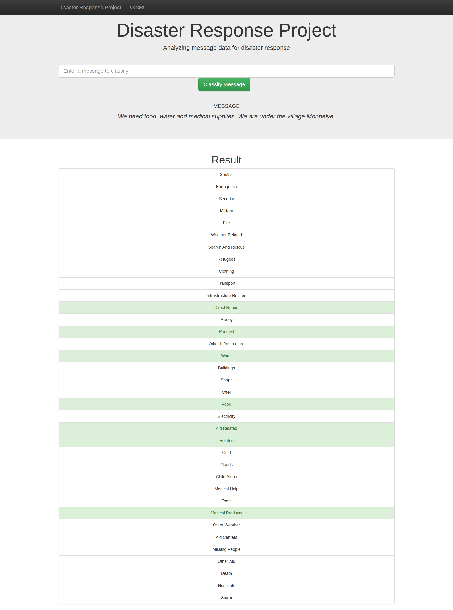
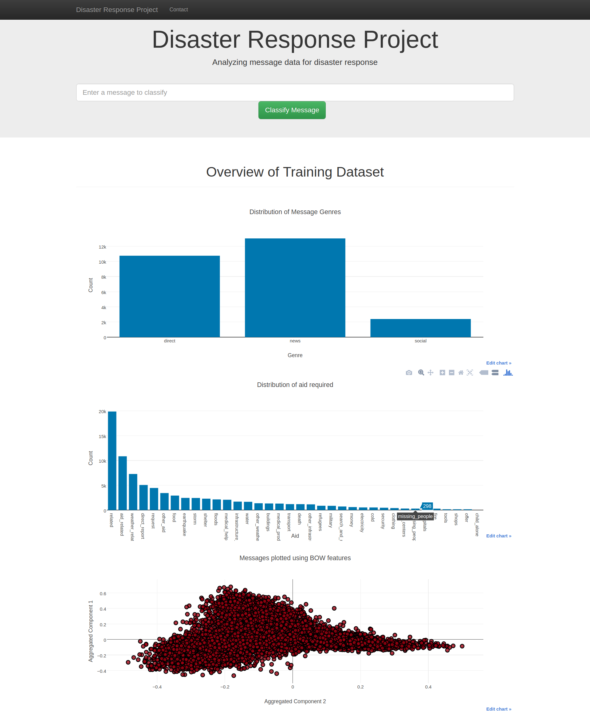

# Disaster Response Pipeline

> An NLP pipeline to clean, preprocess and train a text classifier for disaster response management. 

## Dataset

After or during a disaster, there is usually a lot of communication - either direct or via social media. Disaster response organizations, at that time, have the least capacity to pull out and filter messages which are most important. Generally different organizations take care of different parts of the problem - water, blocked roads, shelter, food, medical supplies etc. 

To remedy this situation, Figure 8 has provided us with pre-labelled tweets and text messages from real-life disasters. I've built a supervised learning model to classify these messages into given disaster categories and encapsulated everything into a Flask application.  

## File Structure

```
- app
| - template
| |- master.html  # main page of web app
| |- go.html  # classification result page of web app
|- run.py  # Flask file that runs app

- data
|- disaster_categories.csv  # data to process 
|- disaster_messages.csv  # data to process
|- process_data.py        # etl pipeline
|- DisasterMessages.db   # database to save clean data to

- models
|- train_classifier.py  # train the model
|- model-adaboost.pkl  # saved model 
```

## Webapp Screenshots

* Classification Screenshot


* Visualization Screenshot


## Installation

1. Install pip
```
sudo apt-get install python-pip
```
2. Install virtualenv
```
sudo pip install virtualenv
```
3. Create a virtualenv for this project
```
virtualenv -p python3 venv
```

## Usage

After cloning this repo, change directory into it and follow the instructions below - 

### Activate the virtualenv and install dependencies

```
source venv/bin/activate
pip install -r requirements.txt
```

### To run ETL pipeline (Cleans data and stores in database)

```bash
python data/process_data.py data/disaster_messages.csv data/disaster_categories.csv data/DisasterResponse.db
```

### To run ML pipeline (Trains classifier and saves the model)

```bash
python models/train_classifier.py data/DisasterResponse.db
```

**Note: Takes about 1 hour 40 minutes to finish training on a 6 core i5 8th gen CPU**

### To run the webapp

```
python app/run.py
```